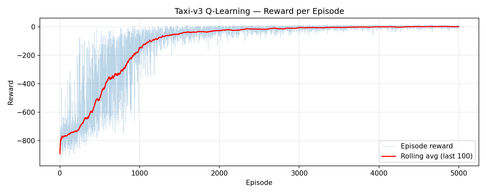
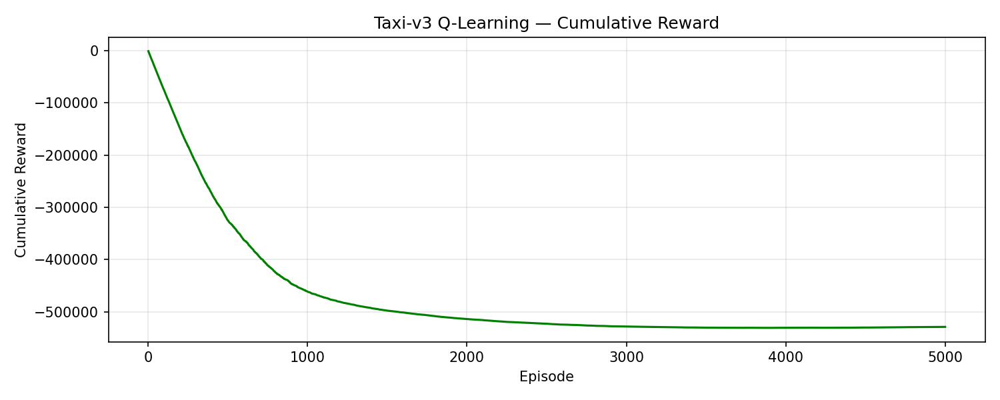
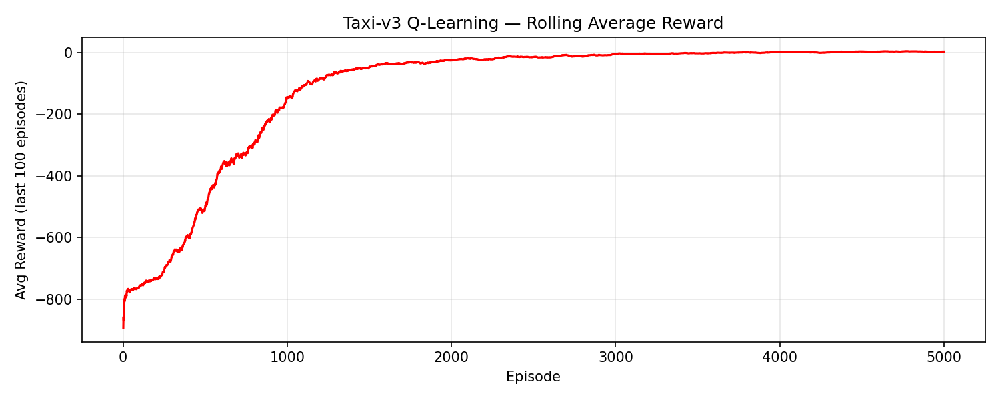
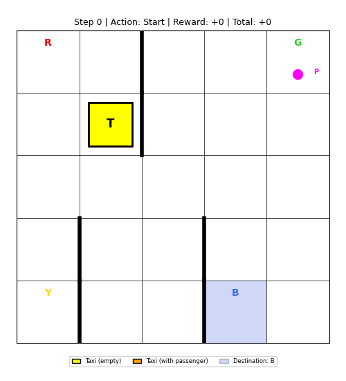
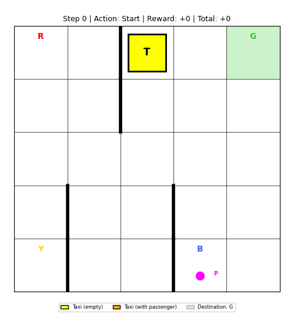
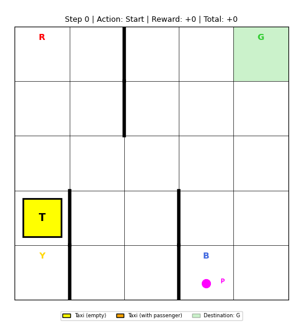
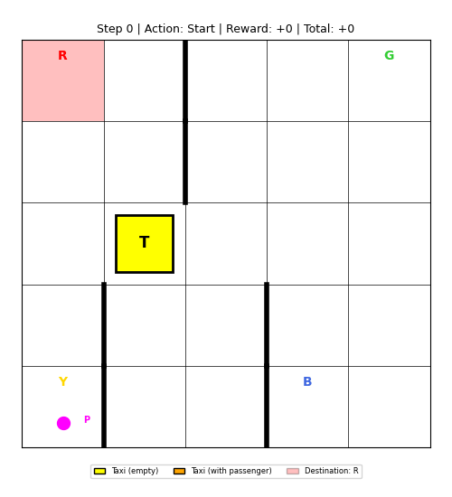

# Taxi-v3 Q-Learning

Q-Learning agent for the [Taxi-v3](https://gymnasium.farama.org/environments/toy_text/taxi/) environment from Gymnasium.

## Results

### Training curves







### Agent demos

| Episode 1 | Episode 2 |
|:---------:|:---------:|
|  |  |

| Episode 3 | Episode 4 |
|:---------:|:---------:|
|  |  |

## Project structure

```
project/
  taxi_qlearning.py   - Training script (Q-learning + reward plots)
  taxi_visualize.py   - Visualization script (GIF animations + ANSI console output)
  pyproject.toml      - Python dependencies
```

## Quick start

### 1. Build and enter the container

```bash
make shell
```

This runs `make build`, `make up`, and `make attach` in sequence.

### 2. Train the agent

```bash
uv run python taxi_qlearning.py
```

Output (saved to `results/`):
- `q_table.npy` - trained Q-table
- `reward_per_episode.png` - per-episode reward + rolling average
- `cumulative_reward.png` - cumulative reward over training
- `rolling_avg_reward.png` - rolling average reward (last 100 episodes)

### 3. Visualize the trained agent

```bash
uv run python taxi_visualize.py
```

Output (saved to `results/gifs/`):
- `episode_1.gif`, `episode_2.gif`, ... - GIF animations of the agent solving the task

Options:
```bash
uv run python taxi_visualize.py --episodes 10      # number of episodes
uv run python taxi_visualize.py --seed 42           # reproducible results
uv run python taxi_visualize.py --no-gif            # console output only
uv run python taxi_visualize.py --verbose           # show full ANSI render per step
```

## Make targets

| Target        | Description                              |
|---------------|------------------------------------------|
| `make build`  | Build the Docker image                   |
| `make up`     | Start the container in background        |
| `make down`   | Stop and remove the container            |
| `make attach` | Attach to the running container          |
| `make shell`  | Build, start, and attach (all-in-one)    |

## Hyperparameters

| Parameter     | Value   | Description                         |
|---------------|---------|-------------------------------------|
| Episodes      | 5000    | Number of training episodes         |
| Alpha         | 0.1     | Learning rate                       |
| Gamma         | 0.99    | Discount factor                     |
| Epsilon start | 1.0     | Initial exploration rate            |
| Epsilon min   | 0.01    | Minimum exploration rate            |
| Epsilon decay | 0.9995  | Multiplicative decay per episode    |
